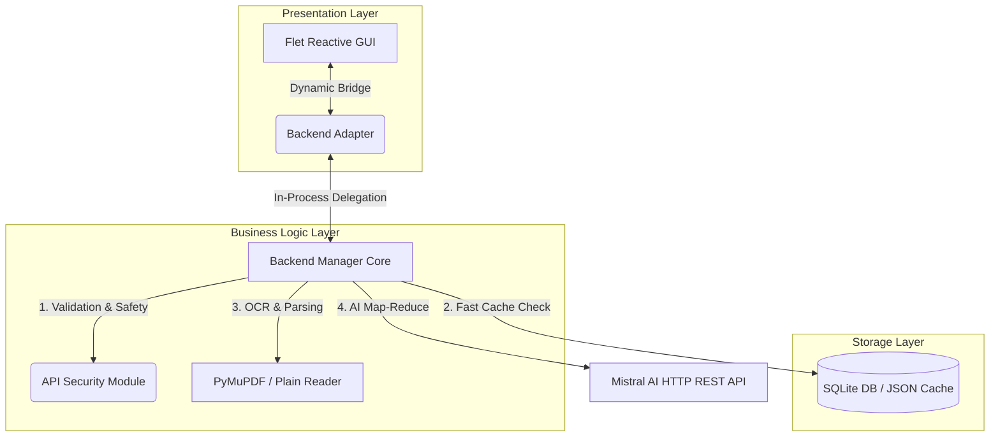

# 📘 SnapSum — Premium Intelligent Document Summarizer & Reading Companion

<p align="center">
  
  
  
  
  
</p>

---

## 🌟 Overview

**SnapSum** is an exquisite, reactive cross-platform mobile and desktop application that redefines how you consume written knowledge. Powered by state-of-the-art **Mistral AI** language models and **Pixtral Vision** OCR intelligence, SnapSum extracts, cleans, and summarizes dense academic or literary documents (`.pdf`, `.txt`, `.png`, `.jpg`, `.jpeg`) into clean, actionable insights. 

Featuring a premium **Material 3** user interface themed around harmonious HSL colors (Indigo, Rose, Slate) and a comfortable **Cozy Cream Paper** reading environment, SnapSum is built to reduce cognitive fatigue while maximizing reading productivity.

---

## 🚀 Key Features

*   **📄 Seamless PDF & TXT Summarization:** Fast and quiet text extraction using custom regex normalizers to eliminate page numbers, dividers, and headers before parsing.
*   **📸 Vision OCR with Pixtral:** Take photos or upload images of book covers or text pages; Pixtral Vision extracts text and generates context-aware summaries instantly.
*   **✂️ Paragraph-Aware Smart Chunking:** Long documents are segmented dynamically (5K-8K characters) while preserving paragraph integrity (`\n\n`), preventing content truncation.
*   **🔄 Asynchronous Map-Reduce Summarization:** Processes large volumes of text by running individual segment summaries (**MAP**) and recursively combining them into a cohesive master summary (**REDUCE**).
*   **💾 Double-Layer SQLite & JSON Caching:** Saves API costs and enables offline reading by caching summaries inside both a high-speed SHA-256 local JSON cache and a structured SQLite database.
*   **🧠 Reader Character Analytics:** Automatically analyzes your reading history categories (Science, History, Drama, Adventure, Philosophy, General) and assigns a custom archetype (e.g., *🔬 Sci-Fi Explorer*, *🧠 Thought Architect*).
*   **📚 Personalized Recommendations:** Generates bespoke book recommendations tailored exactly to your reading archetype using direct Mistral suggestions.
*   **🌐 Real-Time Bilingual Interface:** Dynamically switch the entire user interface and AI summary outputs between Turkish and English on the fly.

---

## 🏗️ Technical Architecture & Data Flow

SnapSum is designed with a highly modular, layered architecture to maintain complete separation between the UI presentation and background intelligence:



### The Summarization Sequence:
1.  **Request Initiation:** The user selects a book, adjusts the summary length (Short, Medium, Long), and clicks *Summarize*.
2.  **Security Firewall:** `api_security.py` runs symbolic link audits, file size caps (max 50MB), path traversal validations, and masks critical API keys.
3.  **Local Cache Lookup:** System checks if the hash of `(File Path + Length + Model + Coverage)` exists in `summary_cache.json` or `snapsum.db`. If found (Cache Hit), it renders the summary instantly without calling the API.
4.  **Parsing & Chunking:** In case of a Cache Miss, PyMuPDF parses the document. The text is normalized and sliced into paragraph-aware chunks.
5.  **Map-Reduce Execution:** Chunks are summarized concurrently/sequentially using `mistral-small-latest` (or `pixtral-large-latest` for images). The generated segment summaries are compiled into a final cohesive Master Summary.
6.  **Persistence:** The new summary is persisted in SQLite and cached in JSON for future instantaneous retrievals.

---

## 🛠️ Technology Stack

| Component | Technology | Description |
| :--- | :--- | :--- |
| **Frontend UI** | [Flet v0.84.0+](https://flet.dev) | Python-based reactive UI framework matching Flutter's standards. |
| **Language & Core** | Python 3.10+ | Modularity, custom regex normalizers, asynchronous loops. |
| **AI Summarization** | Mistral AI API | `mistral-small-latest` for high-fidelity multi-stage text processing. |
| **Vision OCR** | Pixtral Vision | `pixtral-large-latest` for multimodal document & image parsing. |
| **PDF Extraction** | PyMuPDF (fitz) | Lightning-fast PDF text layout parser. |
| **Local Database** | SQLite3 | Stores general/personal libraries, reading history, and profiles. |
| **Security Layer** | Custom Firewall | Rate limiter, Path Traversal defense, API key validators. |

---

## 📁 Repository Structure

```text
SnapSum/
├── backend/                  # AI, NLP, Security and Data Processing Engine
│   ├── database/             # JSON cache directory
│   │   └── summary_cache.json# Local SHA-256 API cache file
│   ├── recommendation/       # Algorithmic reader archetype & profiling engine
│   ├── logs/                 # Security logs and access audits
│   └── api_security.py       # Input validation, Rate Limiting, API Key masking
│
├── mobile/                   # Flet Multiplatform Frontend
│   ├── main.py               # Main app entry, tab router & seed manager
│   ├── app/                  # Application Layer
│   │   ├── config.py         # Global configs, system settings & credentials
│   │   ├── models.py         # Standardized Dataclasses (Book, Profile, etc.)
│   │   ├── data/             # SQLite Data Access Layer (database.py, repository.py)
│   │   ├── services/         # Async sys.path dynamic imports (backend_adapter.py)
│   │   └── ui/               # Custom UI Components (theme.py, book_detail_view.py)
│   └── assets/               # Local icons, vectors, and visuals
│
├── library/                  # Preloaded Default PDF Library Files
├── cleaned_texts/            # 18 Preloaded curated plain text (.txt) classic novels
├── data/                     # Persistent SQLite DB (snapsum.db) & Upload folder
├── docs/                     # Detailed Turkish system architectural documentation
├── tests/                    # Robust unit test suites
└── README.md                 # Primary English guide (This file)
```

---

## 🧪 Installation & Running Guide

Follow these precise steps to set up and run SnapSum locally on your machine:

### 1. Clone the Repository
```bash
git clone https://github.com/elifzehraunal/SnapSum.git
cd SnapSum
```

### 2. Set Up a Virtual Environment (Highly Recommended)
On Windows:
```powershell
python -m venv .venv
.venv\Scripts\activate
```
On macOS/Linux:
```bash
python3 -m venv .venv
source .venv/bin/activate
```

### 3. Install Python Dependencies
```bash
pip install --upgrade pip
pip install -r requirements.txt
```

### 4. Configure Environmental Variables
Create a file named `.env` in the root folder of the project and add your Mistral API Key:
```env
MISTRAL_API_KEY=your_actual_mistral_api_key_here
```
> **Pro Tip:** You can also configure the API Key directly inside the app's Settings panel, which writes to `data/settings.json` locally and keeps your key perfectly secure.

### 5. Launch the Application
Start the multi-platform reactive Flet GUI:
```bash
python mobile/main.py
```

---

## 🛡️ Robust Security Layer

SnapSum implements strict developer-first security designs in `api_security.py`:
*   **Path Traversal & Symlink Defense:** Stops malicious file payloads from escaping the target storage directories.
*   **API Key Masking:** Automatically redacts API keys in system logs (e.g., `MISTRAL_API_KEY: MSTR****k92r`).
*   **Token-Bucket Rate Limiter:** Restricts high-frequency queries to a safe limit of 10 requests per minute per instance.
*   **XSS Input Sanitization:** Safely strips HTML/Script tags from titles, descriptions, and user custom inputs to prevent injection attacks.

---

## 👥 Meet the Core Team

SnapSum was successfully delivered through the coordinated, high-performing collaboration of our 5 core members:

<table align="center">
  <tr>
    <td align="center" width="20%">
      <br/>
      <b>İbrahim</b><br/>
      <small>AI Integration, Chunking & Map-Reduce, Regex Normalizer</small>
    </td>
    <td align="center" width="20%">
      <br/>
      <b>Baran</b><br/>
      <small>SQLite Schemas, JSON Cache, settings.json Configuration</small>
    </td>
    <td align="center" width="20%">
      <br/>
      <b>Elif</b><br/>
      <small>Flet Reactive App Screens, Asynchronous FilePicker, Tab Routing</small>
    </td>
    <td align="center" width="20%">
      <br/>
      <b>Sinem</b><br/>
      <small>Material 3 HSL Theme Colors, Cozy Cream Paper, Component Layouts</small>
    </td>
    <td align="center" width="20%">
      <br/>
      <b>Fatma</b><br/>
      <small>General Library Text Preparation, PDF Scrubbing, Edge-Case Testing</small>
    </td>
  </tr>
</table>

---

## 📄 License

This project is licensed under the MIT License — see the [LICENSE](file:///c:/Users/ibrah/Documents/GitHub/SnapSum/LICENSE) file for complete details.

---

<p align="center">
  Designed with ❤️ by the SnapSum Team.
</p>
