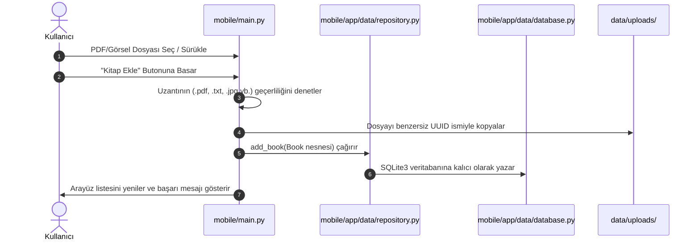
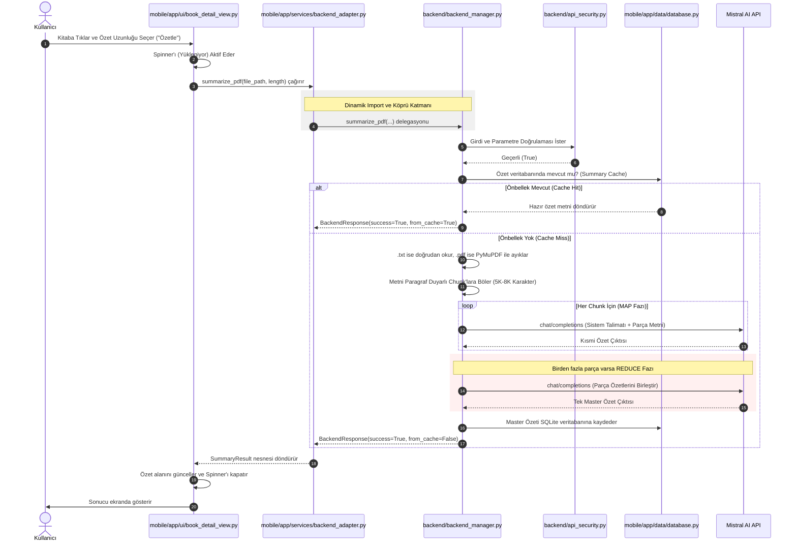

# 🧠 SnapSum Mimari Analiz ve Sistem Dökümantasyonu

Bu döküman, **SnapSum** projesinin genel sistem mimarisini, yönetici özetini, veri akış protokollerini, katmanlar arası entegrasyonu, çözülen kritik bug'ları ve güvenlik standartlarını en ince detaylarına kadar analiz etmek ve belgelemek amacıyla hazırlanmış temel mimari kılavuzdur.

---

## 📑 İçindekiler
1. [📋 Yönetici Özeti ve Hızlı Genel Bakış](#1-yönetici-özeti-ve-hızlı-genel-bakış)
2. [🎯 Proje Genel Tanımı ve Teknolojik Altyapı](#2-proje-genel-tanımı-ve-teknolojik-altyapı)
3. [📂 Genel Dizin Yapısı (Workspace Directory Structure)](#3-genel-dizin-yapısı-workspace-directory-structure)
4. [🏗️ Katmanlı Mimari ve Bileşen Analizi](#4-katmanlı-mimari-ve-bileşen-analizi)
   - [4.1. Ön-Yüz (Frontend - Flet Mobile)](#41-ön-yüz-frontend---flet-mobile)
   - [4.2. Arka-Yüz (Backend Core & AI Engine)](#42-arka-yüz-backend-core--ai-engine)
   - [4.3. Güvenlik ve Doğrulama Katmanı (api_security.py)](#43-güvenlik-ve-doğrulama-katmanı-api_securitypy)
5. [🔄 Veri ve İletişim Akışı (System Data Flow)](#5-veri-ve-iletişim-akışı-system-data-flow)
   - [5.1. Kitap ve Dosya Yükleme Akışı](#51-kitap-ve-dosya-yükleme-akışı)
   - [5.2. Asenkron Map-Reduce Özetleme İstek Akışı](#52-asenkron-map-reduce-özetleme-istek-akışı)
6. [👥 Görev Dağılımı ve Sorumluluklar](#6-görev-dağılımı-ve-sorumluluklar)
7. [✅ Başarıyla Çözülen Kritik Stabilizasyon Sorunları](#7-başarıyla-çözülen-kritik-stabilizasyon-sorunları)
8. [📅 Tamamlanan Geliştirme Yol Haritası](#8-tamamlanan-geliştirme-yol-haritası)

---

## 1. 📋 Yönetici Özeti ve Hızlı Genel Bakış

**SnapSum**, yoğun bilgi çağında kullanıcıların akademik, edebi ve görsel dokümanları en verimli şekilde okumalarını, analiz etmelerini ve yapay zeka yardımıyla özetlemelerini sağlayan reaktif, premium tasarımlı bir mobil ve masaüstü asistanıdır.

### 🚀 Temel Vizyon ve Amaç
SnapSum, geleneksel okuma alışkanlıklarını en son yapay zeka teknolojileriyle harmanlar. Kullanıcıların yüzlerce sayfalık PDF veya düz metin dokümanlarını asenkron bir şekilde özetlemesine imkan tanırken, kitap sayfalarının veya kapaklarının fotoğraflarından Pixtral Vision API ile doğrudan anlamlı özetler çıkarır. SQLite3 tabanlı veri depolama katmanı sayesinde kullanıcıların tüm okuma geçmişini analiz ederek kişiselleştirilmiş okur profilleri oluşturur ve bu profile uygun kitap önerileri sunar.

### 🎨 Renk Paletleri ve Arayüz Temaları
Uygulama, kullanıcı deneyimini zenginleştirmek için 3 premium tema sunar:
*   **Indigo:** Ciddi, odaklanmayı artıran derin mavi tonlar.
*   **Rose:** Yaratıcılığı teşvik eden sıcak, soft pembe tonlar.
*   **Slate:** Modern ve minimal, göz yormayan koyu/açı gri tonlar.
*   **Cozy Cream Paper:** Göz yorgunluğunu en aza indiren özel tasarlanmış kitap okuma arka planı.

---

## 2. Proje Genel Tanımı ve Teknolojik Altyapı

Mimari, ön-yüz ve arka-yüz kodlarını tek bir Python sürecinde (in-process) çalıştırabilen veya gelecekte bağımsız bir HTTP REST API ile ayrıştırılmaya uygun modüler bir yapıda tasarlanmıştır.

### Teknolojik Bileşenler:
*   **Ön-Yüz (Frontend):** Python tabanlı, reaktif ve çoklu platform desteği sunan **Flet Framework** (Material 3 standartlarına tam uyumlu).
*   **Metin Ayıklama (PDF Parser):** PDF belgelerinden metin katmanını hızlıca okumak ve satırları ayıklamak için **PyMuPDF (fitz)** kütüphanesi.
*   **Yapay Zeka Servisleri (LLM & Vision):** Metin özetleme ve analiz işlemleri için tamamen entegre edilmiş **Mistral AI API** (metinler için `mistral-small-latest` ve görsel/OCR analizleri için `pixtral-large-latest` modeli). Google Gemini API bağımlılıkları tamamen temizlenmiştir.
*   **Güvenlik Modülü (api_security.py):** Token Bucket algoritmalı Rate Limiter, girdi sanitizasyonu (Path Traversal ve XSS engelleme) ve API anahtar maskeleme katmanları.
*   **Önbellek (Cache) Mekanizması:** Yapay zeka maliyetlerini sıfırlamak amacıyla SHA-256 tabanlı benzersiz sorgu kimlikleri üreten **JSON dosya tabanlı** yerel önbellek ve SQLite önbelleği.

---

## 3. Genel Dizin Yapısı (Workspace Directory Structure)

SnapSum projesinin kök dizini altındaki klasör ve kritik dosya yapısı aşağıdaki gibidir:

```text
SnapSum/
│
├── .env                        # 🔒 Çevresel değişkenler ve API anahtarı (Git tarafından yoksayılır)
├── .gitignore                  # ⚙️ Git dışı bırakılacak klasör kuralları
├── LICENSE                     # 📄 MIT Lisans dosyası
├── README.md                   # 📄 Proje başlangıç kılavuzu (İngilizce)
│
├── backend/                    # ⚙️ Arka-Yüz (Backend) Kaynak Kodları
│   ├── api_security.py         # 🛡️ Güvenlik katmanı (Limiter, Validator, Audit)
│   ├── backend_manager.py      # ⚙️ Özetleme, normalizasyon ve LLM entegrasyon yöneticisi (Kritik Çelişkili Dosya)
│   │
│   ├── database/               # 💾 Arka-yüz veritabanı/önbellek klasörü
│   │   └── summary_cache.json  # 📦 LLM özet çıktı önbelleği
│   ├── logs/                   # 📝 Güvenlik logları (Git dışı)
│   ├── recommendation/         # 🧠 Okur karakteri analiz motoru ve algoritması
│   └── summarization/          # 📄 Özetleyici bileşenleri
│
├── cleaned_texts/              # 📚 Fatma tarafından hazırlanmış 18 adet düz metin (.txt) klasik kitap dosyası
│
├── data/                       # 📂 Uygulama Veri Depolama Klasörü
│   ├── uploads/                # 📄 Kullanıcılar tarafından yüklenen kişisel PDF/Görsel dosyaları
│   └── snapsum.db              # 💾 SQLite3 yerel veritabanı dosyası (Kitaplar ve özetler kalıcıdır)
│
├── docs/                       # 📄 Proje Dökümantasyonları
│   ├── SnapSum_Dökümantasyon.md# 📑 Bu dökümantasyon dosyası (Türkçe - Merged)
│   ├── API_DOKUMANTASYONU.md   # 🔌 Sınıflar, metotlar ve SQLite şemaları
│   ├── Gorev_Dagilimi.md       # 👥 Ekip rolleri ve sorumlulukları
│   └── Proje_Detay.md          # 📘 Sistem özellikleri ve yol haritası
│
├── library/                    # 📚 Genel Kütüphane Kaynakları
│   ├── metadata/               # 📄 Varsayılan kitap metadata'ları
│   └── pdfs/                   # 📄 Sistemde varsayılan olarak gelen hazır PDF'ler
│
├── mobile/                     # 📱 Ön-Yüz (Flet Mobile Frontend)
│   ├── main.py                 # 🚀 Uygulama ana giriş noktası ve UI yönlendiricisi
│   ├── requirements.txt        # 📦 Mobil arayüz Python bağımlılıkları
│   ├── assets/                 # 🎨 Görsel ve medya dosyaları
│   ├── components/             # 🧱 Tekrar kullanılabilir UI bileşenleri
│   ├── screens/                # 🖥️ Arayüz ekranları
│   │
│   └── app/                    # ⚙️ Ön-yüz İş Mantığı Katmanı
│       ├── __init__.py
│       ├── config.py           # ⚙️ Uygulama yapılandırma değerleri (API Keys, Chunk ayarları vb.)
│       ├── models.py           # 🧱 Veri modelleri (Book veri sınıfı)
│       │
│       ├── data/               # 💾 Veri erişim katmanı
│       │   ├── database.py     # 💾 SQLite3 yerel veritabanı şeması ve SQL yöneticisi
│       │   └── repository.py   # 🧱 SQLite3 veritabanını sarmalayan repository katmanı
│       │
│       ├── services/           # 🔌 Yardımcı servisler
│       │   └── backend_adapter.py # 🌉 Mobil UI ile BackendManager arasındaki dinamik import köprüsü
│       │
│       └── ui/                 # 🎨 Arayüz elemanları ve temalandırma
│           ├── book_detail_view.py # 🖥️ Kitap detay, okuma ve özetleme modal diyaloğu
│           └── theme.py        # 🎨 Özelleştirilmiş Flet UI Renk Teması
│
└── tests/                      # 🧪 Birim testler klasörü
```

---

## 4. Katmanlı Mimari ve Bileşen Analizi

SnapSum projesi, temiz kod prensiplerine uygun katmanlı bir mimariyle tasarlanmıştır.

### 4.1. Ön-Yüz (Frontend - Flet Mobile)
Arayüz bileşenleri `mobile/` dizininde konumlandırılmıştır.
*   **`main.py`:** Uygulama başlatıldığında Flet penceresini reaktif olarak oluşturur, genel kütüphaneyi `cleaned_texts/` klasöründeki 18 adet hazır kitapla tohumlar (`seed_general_books`) ve ana arayüz yapısını (Kütüphane listesi, Arama çubuğu, Dosya Yükleme Paneli ve Profil) yönetir.
*   **`app/models.py`:** Uygulamadaki temel veri birimi olan `Book` yapısını içerir. `id`, `title`, `file_path`, `source`, `summary`, `created_at` gibi alanları barındıran asenkron uyumlu bir `dataclass`'tır.
*   **`app/data/database.py` ve `repository.py`:** Arayüz bileşenlerinin veri ekleme ve listeleme işlemlerini gerçekleştirdiği veri katmanıdır. **SQLite3** tabanlıdır ve `data/snapsum.db` üzerinde kalıcı depolama sağlar.
*   **`app/services/backend_adapter.py`:** Bu sınıf arayüzün backend işlevlerine doğrudan bağımlı kalmasını önler. Python `sys.path` listesine proje kökünü ekler ve `backend/backend_manager.py` içerisindeki `BackendManager`'ı yüklemeye çalışır.

### 4.2. Arka-Yüz (Backend Core & AI Engine)
İş mantığı ve ağır NLP süreçlerinin yürütüldüğü arka plan servisleridir.
*   **`backend/backend_manager.py`:**
    *   **Metin Normalizasyonu:** PDF/TXT dosyasından okunan metindeki sayfa numaraları (`Sayfa 12`), tablo bölücüler (`|---`) ve gereksiz ardışık boşluklar regex kullanılarak temizlenir.
    *   **Paragraf-Duyarlı Chunking:** LLM'e gönderilecek metinlerin model limitlerini aşmaması için metni 5000-8000 karakterlik parçalara böler. Bu bölme işlemini paragrafları koruyarak yapar (`\n\n`), eğer tek bir paragraf çok uzunsa karakter bazlı güvenli fallback uygular.
    *   **Map-Reduce Özetleme:** Metin parçaları tek tek LLM'e gönderilerek parça özetleri alınır (**MAP**). Daha sonra bu parça özetleri birleştirilerek tek bir tutarlı ana özet elde edilir (**REDUCE**).
    *   **Ön-bellek (Cache):** Üretilen özetler, dosya yolu, istenen özet uzunluğu ve kullanılan model parametreleri ile hashlenerek `backend/database/summary_cache.json` dosyasına yazılır. Böylece aynı kitaba ikinci kez özet istendiğinde LLM API'sine gitmeden anında sonuç dönülür.

### 4.3. Güvenlik ve Doğrulama Katmanı (api_security.py)
Backend üzerinde çalışan ve uygulamanın güvenli çalışmasını sağlayan kritik bileşendir.
*   **`APIKeyValidator`:** API anahtarının formatını kontrol eder, loglama esnasında maskeler (`****...r8k`) ve proje dosyalarında kazara hardcoded API key ifşa edilip edilmediğini regex ile tarar.
*   **`RateLimiter`:** Token Bucket yöntemi ile kullanıcının dakikada maksimum 10 istek yapmasını sınırlar.
*   **`InputValidator`:** Kullanıcının seçtiği PDF/Metin/görsel dosyasını boyut (maks 50 MB), desteklenen uzantı (`.pdf`, `.txt`, `.png`, `.jpg`, `.jpeg` vb.) ve **Sembolik Link / Path Traversal** güvenlik risklerine karşı denetler. Kitap başlıklarındaki HTML/Script etiketlerini temizleyerek XSS açıklarını engeller.
*   **`SecurityAudit`:** Tüm API çağrı sürelerini, başarı durumlarını ve güvenlik ihlallerini `backend/logs/security.log` dosyasına yazarak denetim geçmişi oluşturur.

---

## 5. Veri ve İletişim Akışı (System Data Flow)

Uygulamanın çalışması sırasındaki iki kritik akış aşağıda görselleştirilmiş ve açıklanmıştır:

### 5.1. Kitap ve Dosya Yükleme Akışı
Aşağıdaki diyagramda kullanıcının sisteme yeni bir kitap/dosya ekleme süreci gösterilmiştir:



---

### 5.2. Asenkron Map-Reduce Özetleme İstek Akışı
Aşağıdaki diyagramda metin/görsel dosyalarının ayıklanması, chunking'e tabi tutulması ve Mistral AI ile Map-Reduce özetleme akışı gösterilmiştir:



---

## 6. Görev Dağılımı ve Sorumluluklar

SnapSum projesinde ekip üyelerinin üstlendiği temel roller, sorumluluklar ve katkıları aşağıda detaylandırılmıştır. Tüm roller ekip üyeleri arasında başarıyla koordine edilmiş ve SnapSum uygulamasının son kararlı sürümü %100 çalışır şekilde teslim edilmiştir.

*   **İbrahim (Backend Dev):** Yapay Zeka entegrasyonu (Mistral API), Chunking & Map-Reduce algoritması tasarımı, prompt mühendisliği ve PDF/Metin temizleme mantığı (`backend_manager.py`).
*   **Baran (Veritabanı & API):** Uygulama verilerinin SQLite üzerinde yönetimi (`DatabaseManager`), kütüphane ekleme/silme fonksiyonları ve API key konfigürasyonu (`data/settings.json`).
*   **Elif (Mobil Dev):** Flet framework ile uygulamanın mobil/masaüstü reaktif arayüzünün (Library, Upload, Profile sekmeleri) geliştirilmesi, dosya gezgini entegrasyonu ve uygulamanın genel UI navigasyonu (`main.py` ve bileşenler).
*   **Sinem (UI/UX):** Uygulamanın renk paletleri, bileşenlerin konumlandırmaları, kart tasarımları ve genel kullanıcı deneyiminin planlanması.
*   **Fatma (Veri İşleme & Test):** Hazır kütüphanede (`cleaned_texts` klasöründe) bulunacak kitap metinlerinin hazırlanmesi, temizlenmesi ve sistemin farklı dosya türleri/büyüklükleriyle test edilmesi.

---

## 7. Başarıyla Çözülen Kritik Stabilizasyon Sorunları

Yapılan derinlemesine geliştirme ve stabilizasyon çalışmaları sonucunda, uygulamayı engelleyen tüm **kritik sorunlar tamamen çözülmüştür**:

*   **✅ 1. Git Çakışmaları ve Mistral AI Geçişi (Çözüldü):** `backend/backend_manager.py` dosyası içerisindeki git birleştirme çakışma etiketleri tamamen temizlenmiş, Gemini kodları kaldırılarak yerine kararlı, asenkron ve modern **Mistral AI API** entegrasyonu kurulmuştur.
*   **✅ 2. Düz Metin (.txt) / PDF Çift Dosya Desteği (Çözüldü):** Hazır kitapların `.txt` olması durumunda doğrudan UTF-8 formatında okunması, `.pdf` dökümanlarda ise `PyMuPDF (fitz)` kullanılarak sayfa bazlı metin ayıklanması sağlanmıştır. Sistem dosya uzantısına göre dinamik olarak doğru okuyucu metodunu seçmektedir.
*   **✅ 3. Dil Parametresi ve Güvenlik Duvarı Normalizasyonu (Çözüldü):** Flet UI ve `api_security.py` güvenlik modülü arasındaki parametre uyuşmazlığı giderilmiştir. Güvenlik katmanı hem Türkçe (`"Kısa"`, `"Orta"`, `"Uzun"`) hem de İngilizce (`"Short"`, `"Medium"`, `"Long"`) parametrelerini kabul edecek şekilde güncellenmiştir.
*   **✅ 4. Reaktif FilePicker ve Asenkron Dosya İşleme (Çözüldü):** Arayüzde eski ve stabil olmayan `on_result` callback tabanlı dosya seçici mekanizması yerine doğrudan asenkron inline `await file_picker.pick_files()` yapısına geçilmiştir. Bu sayede görsel yükleme, PDF ekleme ve fotoğraf çekip özetleme süreçleri kesintisiz ve hatasız çalışmaktadır.

---

## 8. Tamamlanan Geliştirme Yol Haritası

1.  **SQLite Kalıcı Depolama Entegrasyonu:** Tüm kullanıcı geçmişi, şahsi kitaplar ve özetler `snapsum.db` üzerinde SQLite3 ile başarıyla saklanmaktadır.
2.  **Kişiselleştirilmiş Öneri Motoru:** Kullanıcının okuma geçmişini analiz eden ve buna göre kullanıcıya özel karakterler (örneğin `"🔬 Bilimkurgu Kaşifi"`, `"🧠 Düşünce Mimarı"`) atayarak kitap öneren algoritmik yapı kurulmuştur.
3.  **Mevcut Görsel OCR Analizi (Pixtral Vision):** PNG, JPG, JPEG görsel dosyalarından Pixtral API kullanılarak doğrudan OCR ile analiz ve özetleme yapılabilmektedir.
4.  **Çift Dil Desteği:** Türkçe ve İngilizce dilleri arasında dinamik arayüz geçişleri tamamen entegredir.
5.  **Modern Material 3 Arayüz Tasarımı:** Cozy Cream Paper okuma arka planı, arama kapsülleri, bulut sürükle-bırak göstergesi ile zengin ve premium HSL renk şemaları (Indigo, Rose, Slate) tamamlanmıştır.
